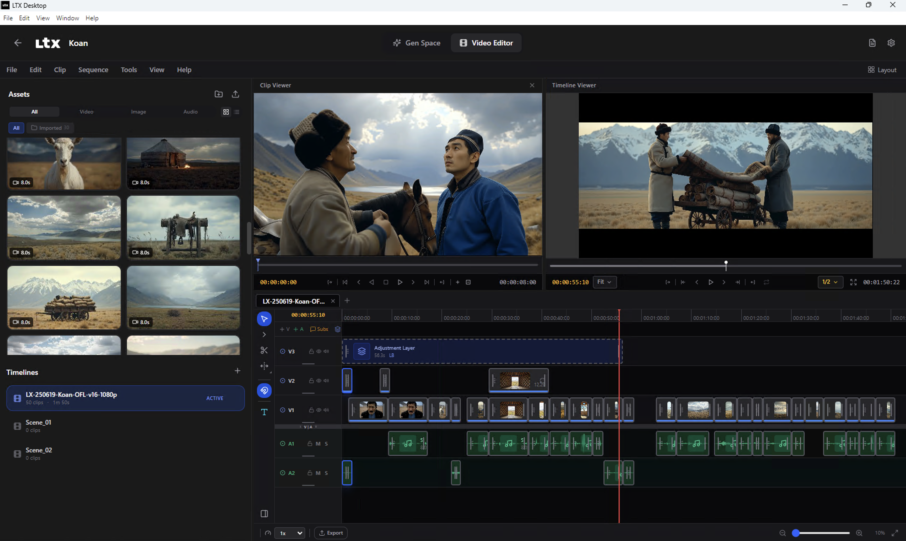
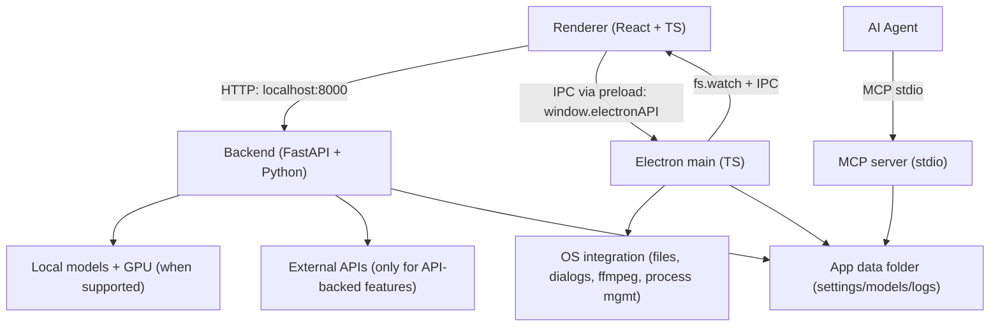
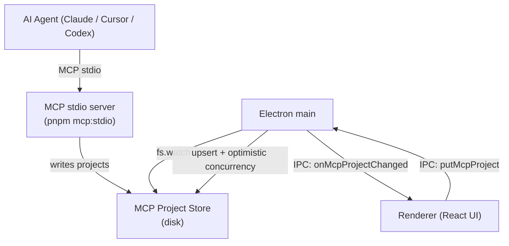

# LTX Desktop

LTX Desktop is an open-source desktop app for generating videos with LTX models — locally on supported Windows/Linux NVIDIA GPUs, with an API mode for unsupported hardware and macOS.

> **Status: Beta.** Expect breaking changes.
> Frontend architecture is under active refactor; large UI PRs may be declined for now (see [`CONTRIBUTING.md`](docs/CONTRIBUTING.md)).

<p align="center">
  
</p>

<p align="center">
  
</p>

<p align="center">
  
</p>

## Fork Contributions — Human-Agent Collaborative Editing

This fork extends LTX Desktop with a full **MCP (Model Context Protocol) server** that enables AI agents to drive the video editor programmatically, while humans continue to use the GUI — both working on the same project in real time.

### What was built

**MCP stdio server** (`pnpm mcp:stdio`) — a standalone process (no desktop app required) that exposes ~45 structured tools across 7 modules:

| Module | Tools |
|---|---|
| `project` | create, open, save, inspect, list projects |
| `assets` | import media, list and inspect assets |
| `timeline` | add/remove/move/trim/split clips, set speed, volume, opacity, color correction, transitions, effects |
| `tracks` | add, remove, reorder, mute/lock tracks |
| `subtitle` | add/update/remove cues, style tracks, progressive word-splitting |
| `text_overlay` | add and style title/callout text clips |
| `export` | start export jobs, poll status |
| `ai_generation` | generate video, retake, gap-fill, cancel |

**Real-time human↔agent sync** — `electron/mcp-project-store.ts` watches the MCP project directory with `fs.watch` and forwards change events into the renderer via IPC (`onMcpProjectChanged`). When the human edits in the GUI, `putMcpProject` (with optimistic concurrency via `updatedAt`) writes changes back to the shared store, keeping both surfaces in sync.

**Agent timeline inspection** — `preview_frame` and `preview_clip` tools render frame-accurate preview images so the agent can visually verify edits without opening the GUI.

**Frontend MCP project browser** — the home screen discovers and surfaces agent-created projects via `listMcpProjects` IPC, letting humans open and continue editing them in the full GUI.

## Local vs API mode

| Platform / hardware | Generation mode | Notes |
| --- | --- | --- |
| Windows + CUDA GPU with **≥16GB VRAM** | Local generation | Downloads model weights locally |
| Windows (no CUDA, <16GB VRAM, or unknown VRAM) | API-only | **LTX API key required** |
| Linux + CUDA GPU with **≥16GB VRAM** | Local generation | Downloads model weights locally |
| Linux (no CUDA, <16GB VRAM, or unknown VRAM) | API-only | **LTX API key required** |
| macOS (Apple Silicon builds) | API-only | **LTX API key required** |

In API-only mode, available resolutions/durations may be limited to what the API supports.

## System requirements

### Windows (local generation)

- Windows 10/11 (x64)
- NVIDIA GPU with CUDA support and **≥16GB VRAM** (more is better)
- 16GB+ RAM (32GB recommended)
- **160GB+ free disk space** (for model weights, Python environment, and outputs)

### Linux (local generation)

- Ubuntu 22.04+ or similar distro (x64 or arm64)
- NVIDIA GPU with CUDA support and **≥16GB VRAM** (more is better)
- NVIDIA driver installed (PyTorch bundles the CUDA runtime)
- 16GB+ RAM (32GB recommended)
- Plenty of free disk space for model weights and outputs

### macOS (API-only)

- Apple Silicon (arm64)
- macOS 13+ (Ventura)
- Stable internet connection

## Install

1. Download the latest installer from GitHub Releases: [Releases](../../releases)
2. Install and launch **LTX Desktop**
3. Complete first-run setup

## First run & data locations

LTX Desktop stores app data (settings, models, logs) in:

- **Windows:** `%LOCALAPPDATA%\LTXDesktopCustom\`
- **macOS:** `~/Library/Application Support/LTXDesktopCustom/`
- **Linux:** `$XDG_DATA_HOME/LTXDesktopCustom/` (default: `~/.local/share/LTXDesktopCustom/`)

Model weights are downloaded into the `models/` subfolder (this can be large and may take time). The app runtime itself is bundled with the packaged build, so installer startup does not fetch Python separately.

On first launch you may be prompted to review/accept model license terms (license text is fetched from Hugging Face; requires internet).

Text encoding: to generate videos you must configure text encoding:

- **LTX API key** (cloud text encoding) — **text encoding via the API is completely FREE** and highly recommended to speed up inference and save memory. Generate a free API key at the [LTX Console](https://console.ltx.video/). [Read more](https://ltx.io/model/model-blog/ltx-2-better-control-for-real-workflows).
- **Local Text Encoder** (extra download; enables fully-local operation on supported Windows hardware) — if you don't wish to generate an API key, you can encode text locally via the settings menu.

## API keys, cost, and privacy

### LTX API key

The LTX API is used for:

- **Cloud text encoding and prompt enhancement** — **FREE**; text encoding is highly recommended to speed up inference and save memory
- API-based video generations (required on macOS and on unsupported Windows hardware) — paid
- Retake — paid

An LTX API key is required in API-only mode, but optional on Windows/Linux local mode if you enable the Local Text Encoder.

Generate a FREE API key at the [LTX Console](https://console.ltx.video/). Text encoding is free; video generation API usage is paid. [Read more](https://ltx.io/model/model-blog/ltx-2-better-control-for-real-workflows).

When you use API-backed features, prompts and media inputs are sent to the API service. Your API key is stored locally in your app data folder — treat it like a secret.

### fal API key (optional)

Used for Z Image Turbo text-to-image generation in API mode. When enabled, image generation requests are sent to fal.ai.

Create an API key in the [fal dashboard](https://fal.ai/dashboard/keys).

### Gemini API key (optional)

Used for AI prompt suggestions. When enabled, prompt context and frames may be sent to Google Gemini.

## Architecture

LTX Desktop is split into three main layers:

- **Renderer (`frontend/`)**: TypeScript + React UI.
  - Calls the local backend over HTTP at `http://localhost:8000`.
  - Talks to Electron via the preload bridge (`window.electronAPI`).
- **Electron (`electron/`)**: TypeScript main process + preload.
  - Owns app lifecycle and OS integration (file dialogs, native export via ffmpeg, starting/managing the Python backend).
  - Security: renderer is sandboxed (`contextIsolation: true`, `nodeIntegration: false`).
- **Backend (`backend/`)**: Python + FastAPI local server.
  - Orchestrates generation, model downloads, and GPU execution.
  - Calls external APIs only when API-backed features are used.



## Development (quickstart)

Prereqs:

- Node.js
- `uv` (Python package manager)
- Python 3.12+
- Git

Setup:

```bash
pnpm setup:dev
```

Run:

```bash
pnpm dev
```

Debug:

```bash
pnpm dev:debug
```

`dev:debug` starts Electron with inspector enabled and starts the Python backend with `debugpy`.

Typecheck:

```bash
pnpm typecheck
```

Backend tests:

```bash
pnpm backend:test
```

Building installers:
- See [`INSTALLER.md`](docs/INSTALLER.md)

## AI Assistant / MCP Setup

LTX Desktop exposes MCP as a standalone `stdio` server. The desktop app does not need to be open for an agent to use MCP tools — but if it is open, agent edits appear in the GUI in real time.

### Architecture



The agent and human share the same on-disk `ProjectStore`. Electron watches the directory with `fs.watch` and pushes change events to the renderer via IPC. When the human edits in the GUI, `putMcpProject` (with `updatedAt` optimistic concurrency) writes changes back without clobbering in-flight agent edits.

### Launch

Development:

```bash
pnpm mcp:stdio
```

Packaged:

```bash
ltx-desktop mcp stdio
```

### Client configuration

```json
{
  "mcpServers": {
    "ltx-desktop": {
      "command": "pnpm",
      "args": ["mcp:stdio"]
    }
  }
}
```

### Repository guidance files

- [`AGENTS.md`](AGENTS.md) — shared repo instructions for AI agents
- [`docs/AGENT_PREVIEW_TOOLING_PLAN.md`](docs/AGENT_PREVIEW_TOOLING_PLAN.md) — architecture plan for agent timeline inspection and preview tools
- [`docs/AGENT_PREVIEW_TOOLING_CHECKLIST.md`](docs/AGENT_PREVIEW_TOOLING_CHECKLIST.md) — implementation checklist for preview tooling
- [`docs/skills/video-editor-development.md`](docs/skills/video-editor-development.md) — shared editor architecture guidance

## Telemetry

LTX Desktop collects minimal, anonymous usage analytics (app version, platform, and a random installation ID) to help prioritize development. No personal information or generated content is collected. Analytics is enabled by default and can be disabled in **Settings > General > Anonymous Analytics**. See [`TELEMETRY.md`](docs/TELEMETRY.md) for details.

## Docs

- [`INSTALLER.md`](docs/INSTALLER.md) — building installers
- [`TELEMETRY.md`](docs/TELEMETRY.md) — telemetry and privacy
- [`backend/architecture.md`](backend/architecture.md) — backend architecture

## Contributing

See [`CONTRIBUTING.md`](docs/CONTRIBUTING.md).

## License

Apache-2.0 — see [`LICENSE.txt`](LICENSE.txt).

Third-party notices (including model licenses/terms): [`NOTICES.md`](NOTICES.md).

Model weights are downloaded separately and may be governed by additional licenses/terms.
